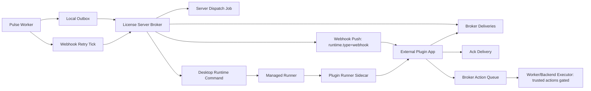

# Custom Plugin Broker Runtime

Updated: 2026-05-28

This document describes the current implemented Custom Plugin Broker runtime. It is an operator/developer contract for polling, feature-flagged webhook push, SDK config/storage/secrets, safe `logs.write`, read-only `orders.get`/`orders.list`/`lots.get`/`lots.list`, Desktop-managed `broker-poller` launch, and disabled-by-default trusted executor foundations for `messages.send`, `orders.refund`, `orders.review.reply`, `lots.active.set`, `lots.price.set`, `lots.raise`, `blacklist.add`, and `blacklist.remove`. It is not a promise that all future SDK/marketplace features already exist.

## Current Status

Implemented:

- license-server Broker API under `/api/v2/broker`;
- Worker/Backend local sanitized event outbox;
- signed Worker-to-Broker ingest responses;
- local outbox retention/prune;
- plugin-side polling and ack through raw Broker tokens;
- read-only plugin install config endpoint `GET /api/v2/broker/config`;
- non-secret per-installation storage endpoint `GET/PUT/DELETE /api/v2/broker/storage/{key}`;
- encrypted per-installation secret endpoint `GET/PUT/DELETE /api/v2/broker/secrets/{key}`;
- safe Broker action queue endpoint `POST /api/v2/broker/actions` for `logs.write`, `orders.get`, `orders.list`, `lots.get`, and `lots.list`;
- safe Broker action status/result endpoint `GET /api/v2/broker/actions/{action_id}`;
- feature-gated Broker `messages.send`, `orders.refund`, `orders.review.reply`, `lots.active.set`, `lots.price.set`, `lots.raise`, `blacklist.add`, and `blacklist.remove` queues, HMAC Worker claim/report endpoints, and mirrored Worker/Backend executor, all disabled by default;
- public marketplace free claim and paid `marketplace_plugin` checkout entitlement activation;
- SDK polling/action client `funpay_pulse_sdk.BrokerClient`;
- SDK local fixture client `funpay_pulse_sdk.FixtureBrokerClient` for offline plugin development.
- SDK local package builder `pulse-plugin pack` for deterministic `.fppkg` review artifacts.
- SDK CLI `pulse-plugin download-package` for broker-token scoped installed
  `.fppkg` downloads with manifest SHA-256 verification and no raw token output.
- server-side private `.fppkg` upload endpoint that verifies the archive again
  and stores package metadata on `PluginVersion`.
- broker-token scoped installed package manifest/download endpoints:
  `GET /api/v2/broker/package/manifest` and
  `GET /api/v2/broker/package/download`.
- feature-flagged webhook push delivery for `runtime.type="webhook"`:
  `GET /api/v2/broker/webhook/secret` returns the per-installation HMAC secret,
  and Worker ingest attempts signed POST delivery to the manifest `runtime.url`.
- signed Worker webhook dispatch endpoint
  `POST /api/v2/broker/webhook/dispatch`: Worker/Backend publisher can
  periodically ask license-server to retry due pending webhook deliveries for
  that VPS only. The response is signed, no-store and count-only.
- optional license-server background webhook dispatcher. When
  `CUSTOM_PLUGIN_BROKER_SERVER_WEBHOOK_DISPATCH_ENABLED=true`, license-server
  claims due deliveries, commits the claim, performs outbound HTTP outside the
  request DB transaction, then completes the delivery in a separate transaction.
- Desktop managed runtime control for installed `runtime.type="broker-poller"`
  packages. The license-server stores desired runtime state; Worker/Backend
  runner claims jobs, bootstraps package metadata without exposing raw Broker
  tokens to React, verifies package/runtime type, and delegates execution to
  the sidecar control plane when configured.

Not implemented yet:

- managed runtime SLA for arbitrary runtime types;
- per-installation container/UID/cgroup isolation. The current sidecar path is
  an MVP control plane and must not be described as full sandbox isolation;
- normal/public registration rollout for FunPay-mutating Broker actions such as `messages.send`, `orders.refund`, `orders.review.reply`, `lots.active.set`, `lots.price.set`, `lots.raise`, `blacklist.add`, and `blacklist.remove`;
- plugin-side config writes;
- publisher dashboard and automated payout batches;
- arbitrary third-party Python/JS upload into Worker.

The security rule remains unchanged: third-party plugin code must not be
imported or executed inside the `Pulse worker` or `Pulse backend` application
process. The managed path runs `broker-poller` packages in the plugin runner
sidecar on the selected VPS.

## Runtime Flow

1. Worker observes a supported internal event.
2. Worker sanitizes the event through an allowlist.
3. Worker stores the event in local `broker_outbox_events`.
4. Worker publisher posts a signed batch to license-server `/api/v2/broker/events/ingest`.
5. License-server stores a redacted immutable Broker event and creates deliveries for active installations with matching scopes.
6. External plugin app polls `/api/v2/broker/events` with its raw `fppb_...` Broker token.
7. Plugin app acknowledges each delivery through `/api/v2/broker/events/{delivery_id}/ack`.
8. Plugin app can read its own install config through `/api/v2/broker/config`.
9. If the installed manifest has `storage:own`, plugin app can use non-secret storage through `/api/v2/broker/storage/{key}`.
10. If the installed manifest has `secrets:own`, plugin app can use encrypted third-party secret storage through `/api/v2/broker/secrets/{key}`.
11. If the installed manifest has `logs:write`, plugin app can submit `logs.write` through `/api/v2/broker/actions`.
12. If the installed manifest has `orders:read`, `orders:list`, or `lots:read`, plugin app can submit the matching read-only `orders.get`, `orders.list`, `lots.get`, or `lots.list` query actions.
13. If a trusted rollout has explicitly granted `messages:send`, `orders:refund`, `orders:review`, `lots:active`, `lots:price`, `lots:raise`, `blacklist:add`, or `blacklist:remove`, plugin app can submit `messages.send`, `orders.refund`, `orders.review.reply`, `lots.active.set`, `lots.price.set`, `lots.raise`, `blacklist.add`, or `blacklist.remove`; Worker/Backend claims and reports execution through HMAC-signed Broker endpoints.
14. Plugin app can poll `/api/v2/broker/actions/{action_id}` for safe status/result fields without receiving action input or Worker lease tokens.
15. If `CUSTOM_PLUGIN_BROKER_PACKAGE_DOWNLOAD_ENABLED=true`, plugin app can read the installed version package manifest and download exactly the pinned `.fppkg` attached to its own installation.
16. If the installed version uses `runtime_type="webhook"` and `CUSTOM_PLUGIN_BROKER_WEBHOOK_PUSH_ENABLED=true`, license-server can POST a signed redacted event envelope to the manifest `runtime.url`. A 2xx response acks the delivery; failures remain available through polling.
17. If server-side dispatch is enabled, license-server periodically retries due webhook deliveries from its own background task. The claim is committed before HTTP and the ack/failure result is written afterward.
18. Worker/Backend can also call `POST /api/v2/broker/webhook/dispatch` with per-VPS HMAC auth. This endpoint is still useful for per-VPS/manual retry and compatibility; license-server retries only due pending deliveries for that VPS, bounded by batch limit and `CUSTOM_PLUGIN_BROKER_WEBHOOK_PUSH_RETRY_SECONDS`.
19. For installed `runtime.type="broker-poller"` packages, Desktop can request
    runtime `start`, `stop` or `restart`. The license-server re-checks
    ownership, subscription/custom-plugin capability, product/grant/install
    state and current runtime type before writing the command.
20. The managed runner claims the start job, downloads the pinned package
    through the Broker package path, verifies package SHA/runtime type, writes
    the Broker token to a protected runtime file and starts the plugin in the
    sidecar. The raw token is not returned to the Desktop renderer.



## License-Server Flags

These flags live on the license-server side.

| Variable | Default | Meaning |
| --- | --- | --- |
| `CUSTOM_PLUGINS_ENABLED` | `false` | Enables custom plugin platform create/install surfaces. |
| `CUSTOM_PLUGINS_PRIVATE_BETA` | `false` | Enables authenticated private plugin registration/install MVP. |
| `CUSTOM_PLUGIN_BROKER_EVENTS_ENABLED` | `false` | Enables Broker ingest, poll, and ack. |
| `CUSTOM_PLUGIN_BROKER_ACTIONS_ENABLED` | `false` | Enables plugin-originated Broker actions. Current public-safe allowlist: `logs.write`, `orders.get`, `orders.list`, `lots.get`, `lots.list`. |
| `CUSTOM_PLUGIN_BROKER_MESSAGES_SEND_ENABLED` | `false` | Allows `messages.send` to be queued, claimed, and reported for trusted installations with `messages:send`. |
| `CUSTOM_PLUGIN_BROKER_ORDERS_REFUND_ENABLED` | `false` | Allows `orders.refund` to be queued, claimed, and reported for trusted installations with `orders:refund`. |
| `CUSTOM_PLUGIN_BROKER_ORDERS_REVIEW_REPLY_ENABLED` | `false` | Allows `orders.review.reply` to be queued, claimed, and reported for trusted installations with `orders:review`. |
| `CUSTOM_PLUGIN_BROKER_LOTS_ACTIVE_SET_ENABLED` | `false` | Allows `lots.active.set` to be queued, claimed, and reported for trusted installations with `lots:active`. |
| `CUSTOM_PLUGIN_BROKER_LOTS_PRICE_SET_ENABLED` | `false` | Allows `lots.price.set` to be queued, claimed, and reported for trusted installations with `lots:price`. |
| `CUSTOM_PLUGIN_BROKER_LOTS_RAISE_ENABLED` | `false` | Allows `lots.raise` to be queued, claimed, and reported for trusted installations with `lots:raise`. |
| `CUSTOM_PLUGIN_BROKER_BLACKLIST_ADD_ENABLED` | `false` | Allows `blacklist.add` to be queued, claimed, and reported for trusted installations with `blacklist:add`. |
| `CUSTOM_PLUGIN_BROKER_BLACKLIST_REMOVE_ENABLED` | `false` | Allows `blacklist.remove` to be queued, claimed, and reported for trusted installations with `blacklist:remove`. |
| `CUSTOM_PLUGIN_BROKER_STORAGE_ENABLED` | `false` | Enables non-secret plugin-owned storage for installations with `storage:own`. |
| `CUSTOM_PLUGIN_BROKER_SECRETS_ENABLED` | `false` | Enables encrypted plugin-owned secret storage for installations with `secrets:own`. |
| `CUSTOM_PLUGIN_SECRET_ENCRYPTION_KEY` | empty | Fernet key used for plugin secret encryption at rest. Secret endpoints fail closed when it is missing or invalid. |
| `CUSTOM_PLUGIN_BROKER_PACKAGE_DOWNLOAD_ENABLED` | `false` | Enables broker-token scoped package manifest/download for the installed version. |
| `CUSTOM_PLUGIN_BROKER_WEBHOOK_PUSH_ENABLED` | `false` | Enables best-effort signed webhook POST delivery for installed versions with `runtime_type="webhook"`. |
| `CUSTOM_PLUGIN_BROKER_WEBHOOK_SIGNING_KEY` | empty | Server secret used to derive per-installation `fppwh_...` webhook HMAC secrets. Webhook secret endpoint and push fail closed when missing. |
| `CUSTOM_PLUGIN_BROKER_WEBHOOK_PUSH_TIMEOUT_SECONDS` | `2.0` | HTTP timeout for one webhook push attempt. |
| `CUSTOM_PLUGIN_BROKER_WEBHOOK_PUSH_RETRY_SECONDS` | `60` | Minimum delay before retrying a failed webhook delivery when dispatch runs again. |
| `CUSTOM_PLUGIN_BROKER_WEBHOOK_PUSH_BATCH_LIMIT` | `50` | Max pending webhook deliveries attempted per dispatch pass. |
| `CUSTOM_PLUGIN_BROKER_WEBHOOK_ALLOW_LOCALHOST` | `false` | Allows localhost/loopback webhook URLs only for local development. Keep `false` in production. |
| `CUSTOM_PLUGIN_BROKER_SERVER_WEBHOOK_DISPATCH_ENABLED` | `false` | Starts license-server's own due webhook retry loop. HTTP is executed outside the request DB transaction. |
| `CUSTOM_PLUGIN_BROKER_SERVER_WEBHOOK_DISPATCH_INTERVAL_SECONDS` | `30` | Sleep interval for the server-side webhook dispatcher, clamped to `5..3600`. |
| `CUSTOM_PLUGIN_BROKER_SERVER_WEBHOOK_DISPATCH_LIMIT` | `50` | Max due webhook deliveries attempted per server dispatch pass, clamped to `1..200`. |
| `CUSTOM_PLUGIN_PACKAGE_STORAGE` | `./data/custom-plugin-packages` | License-server storage root for verified private `.fppkg` artifacts. Files are stored by computed package SHA-256, not by uploaded filename or archive path. |
| `CUSTOM_PLUGIN_BROKER_ACTION_LEASE_SECONDS` | `120` | Lease duration for Worker/Backend claimed executable actions. |
| `CUSTOM_PLUGIN_BROKER_VISIBILITY_TIMEOUT_SECONDS` | `60` | Redelivery delay for delivered but unacked events. |

`CUSTOM_PLUGIN_BROKER_EVENTS_ENABLED=false` makes Broker ingest/poll/ack fail closed. `CUSTOM_PLUGIN_BROKER_ACTIONS_ENABLED=false` makes `/api/v2/broker/actions` fail closed. `CUSTOM_PLUGIN_BROKER_PACKAGE_DOWNLOAD_ENABLED=false` makes package manifest/download fail closed. `CUSTOM_PLUGIN_BROKER_WEBHOOK_PUSH_ENABLED=false` disables push delivery but does not disable polling. `CUSTOM_PLUGIN_BROKER_SERVER_WEBHOOK_DISPATCH_ENABLED=false` disables only the license-server background retry loop; Worker/manual dispatch and polling can still operate if their own flags stay enabled.

## Worker/Backend Publisher Flags

These flags live in the Worker/Backend environment. The publisher is off by default.

| Variable | Default | Clamp | Meaning |
| --- | --- | --- | --- |
| `CUSTOM_PLUGIN_BROKER_PUBLISHER_ENABLED` | off | boolean | Starts the local EventBus subscriber and outbox publisher. |
| `CUSTOM_PLUGIN_BROKER_BATCH_SIZE` | `100` | `1..100` | Max outbox rows claimed per ingest batch. |
| `CUSTOM_PLUGIN_BROKER_FLUSH_INTERVAL_SECONDS` | `5` | `1..60` | Background flush loop interval. |
| `CUSTOM_PLUGIN_BROKER_OUTBOX_RETENTION_DAYS` | `14` | `1..365` | How long terminal local outbox rows are kept. |
| `CUSTOM_PLUGIN_BROKER_PRUNE_INTERVAL_SECONDS` | `3600` | `60..86400` | How often local outbox prune runs while publisher is active. |
| `CUSTOM_PLUGIN_BROKER_PRUNE_BATCH_SIZE` | `1000` | `1..10000` | Max terminal rows deleted per prune pass. |
| `CUSTOM_PLUGIN_BROKER_PRUNE_ENABLED` | `true` | boolean | Emergency kill switch for local delete operations only. |
| `CUSTOM_PLUGIN_BROKER_WEBHOOK_DISPATCH_ENABLED` | `true` | boolean | When publisher is active, periodically requests license-server retry dispatch for due webhook deliveries owned by this VPS. |
| `CUSTOM_PLUGIN_BROKER_WEBHOOK_DISPATCH_INTERVAL_SECONDS` | `30` | `5..3600` | Minimum interval between Worker/Backend dispatch ticks. License-server still enforces per-delivery retry cutoff. |
| `CUSTOM_PLUGIN_BROKER_WEBHOOK_DISPATCH_LIMIT` | `50` | `1..200` | Max due webhook deliveries requested per dispatch tick. |
| `CUSTOM_PLUGIN_BROKER_ACTION_EXECUTOR_ENABLED` | off | boolean | Starts the local executable action poller. Required for trusted mutating actions. |
| `CUSTOM_PLUGIN_BROKER_ACTION_BATCH_SIZE` | `25` | `1..50` | Max executable actions claimed per action poll. |
| `CUSTOM_PLUGIN_BROKER_ACTION_INTERVAL_SECONDS` | `3` | `1..60` | Background action claim loop interval. |
| `CUSTOM_PLUGIN_BROKER_ACTION_MIN_CHAT_INTERVAL_SECONDS` | `1` | `0..60` | Local per-account/chat minimum interval before sending messages. |
| `CUSTOM_PLUGIN_MANAGED_RUNNER_ENABLED` | `true` | boolean | Enables Worker/Backend managed runtime job polling for installed SDK plugins. |
| `CUSTOM_PLUGIN_MANAGED_RUNNER_ID` | generated | string | Stable runner id reported to license-server runtime status. |
| `CUSTOM_PLUGIN_MANAGED_RUNNER_VERSION` | `0.1.0` | string | Runner version reported to license-server runtime status. |
| `CUSTOM_PLUGIN_MANAGED_RUNNER_SIDECAR_URL` | empty | URL | Required for production managed launch. Points to the local sidecar control API. |
| `CUSTOM_PLUGIN_SIDECAR_CONTROL_TOKEN` | empty | secret | Required shared control token between runner and sidecar. Missing token makes sidecar control fail closed. |
| `CUSTOM_PLUGIN_MANAGED_RUNNER_SIDECAR_TIMEOUT_SECONDS` | `10` | `1..120` | HTTP timeout for runner-to-sidecar control calls. |
| `CUSTOM_PLUGIN_MANAGED_RUNNER_DIR` | `./data/plugin-runner` | path | Runner local metadata/package workspace. |
| `CUSTOM_PLUGIN_MANAGED_RUNNER_INTERVAL_SECONDS` | `5` | `1..60` | Runtime job poll/reconcile interval. |
| `CUSTOM_PLUGIN_MANAGED_RUNNER_BATCH_SIZE` | `10` | `1..50` | Max runtime jobs claimed per runner poll. |
| `CUSTOM_PLUGIN_MANAGED_RUNNER_ALLOW_LOCAL_EXECUTION` | `false` | boolean | Developer-only unsafe fallback. Keep disabled in production; without sidecar URL the runner fails closed. |

The publisher and action executor only start after the V2 license client is initialized. If the publisher is disabled or the client is not initialized, prune and webhook dispatch ticks also do not run.

## Managed Broker-Poller Runner

The managed runner removes the normal buyer need to copy a Broker token and run
`python app.py` manually. It currently supports only installed packages whose
manifest runtime is `broker-poller`.

Desktop flow:

1. User opens `Мои плагины`.
2. User installs an available marketplace/private plugin on an owned VPS.
3. For `broker-poller`, Desktop sends `runtime/start`.
4. License-server writes a managed runtime command only after owner,
   subscription/custom-plugin capability, install, grant/purchase and runtime
   type checks pass.
5. Worker/Backend runner claims the job and talks to the local sidecar with
   `X-Runner-Control-Token`.
6. Sidecar starts the plugin process with `FPP_BASE_URL` and
   `FPP_BROKER_TOKEN_FILE`.

Important boundaries:

- raw Broker token is not shown in the Desktop renderer for managed installs;
- sidecar derives `FPP_BASE_URL` from its own `API_URL`, not from the job
  payload;
- sidecar accepts HTTPS API URLs by default. Plain HTTP loopback is allowed
  only with `CUSTOM_PLUGIN_SIDECAR_ALLOW_INSECURE_LOCALHOST=1` for local tests;
- unsupported runtime types return `unsupported_runtime_type` and must use a
  manual/self-hosted flow;
- current MVP still shares sidecar-level OS/container resources. Treat it as
  controlled execution, not as strong per-plugin sandboxing.

## Event Contract

Supported event scopes:

- `events:new_message`
- `events:new_order`
- `events:order_confirmed`
- `events:new_review`

Worker drops baseline/own messages and builds payloads by allowlist. It does not copy raw scheduler objects, decrypted secrets, connection tokens, golden keys, proxy details, local file paths, raw cookies, or plugin internals.

Broker poll response:

```json
{
  "items": [
    {
      "delivery_id": "del_...",
      "event_id": "evt_...",
      "event_type": "events:new_message",
      "payload": {
        "schema_version": "broker.events.v1",
        "event_type": "events:new_message",
        "occurred_at": "2026-05-02T10:00:00Z"
      },
      "created_at": "2026-05-02T10:00:00",
      "delivered_at": "2026-05-02T10:00:01"
    }
  ],
  "count": 1
}
```

## SDK Polling Example

```python
import logging
import os

from funpay_pulse_sdk import BrokerClient, NewMessageEvent, parse_broker_event

logger = logging.getLogger("my_plugin")

client = BrokerClient(
    base_url="https://funpaypulse.com",
    broker_token=os.environ["FPP_BROKER_TOKEN"],
)

for event in client.poll_events(limit=50):
    # Persist/process first. Ack only after the work is durable.
    typed = parse_broker_event(event)
    if isinstance(typed, NewMessageEvent):
        logger.info("message chat=%s text=%r", typed.chat_id, typed.text)
    else:
        logger.info("received broker event %s delivery=%s", event.event_type, event.delivery_id)
    client.ack_event(event.delivery_id)
```

For managed `broker-poller` installs, Desktop does not show the raw Broker token
in the renderer. Manual/debug installs can still use a one-time Broker token;
store it in the external plugin app secret store, not in source code or logs.

For local development against a local license-server, `BrokerClient(..., allow_insecure_localhost=True)` permits plain HTTP only for real loopback hosts such as `localhost`, `127.0.0.1` or `::1`. Do not use this flag for remote hosts.

Manual production hosting is documented in `docs/PLUGIN_RUNTIME_SELF_HOSTING.md`.
Use it for development, unsupported runtimes, emergency debugging or
developer-operated services. The normal Desktop flow for `broker-poller`
marketplace plugins should use the managed runner so users do not handle raw
Broker tokens.

## SDK Local Fixtures

Developers can start with a local broker-poller template before they have a real installation:

```bash
pulse-plugin init seller_auto_reply
cd seller_auto_reply
pulse-plugin check . --allow-localhost
pulse-plugin pack . --allow-localhost
python app.py --fixtures fixtures/events.json
```

For order/lot plugins, use the read-first template:

```bash
pulse-plugin init seller_order_helper --template order-assistant
cd seller_order_helper
python app.py --fixtures fixtures/events.json --write-log-actions
```

The order assistant template demonstrates runtime capabilities checks,
read-only order/lot query actions, plugin-owned storage, and Broker secret
storage without giving the plugin FunPay credentials or Worker internals.

The fixture path uses `FixtureBrokerClient` and simulates the plugin-side poll/ack loop plus local action recording. It does not create marketplace entitlements, does not issue a real `fppb_...` token, and does not grant real action scopes.

`pulse-plugin check` is the safe local gate for generated or reviewed plugin
trees: it validates the manifest and fixture deliveries without importing or
executing `app.py`.

`pulse-plugin pack` is the next local gate: it validates the manifest, validates
fixtures when present, and writes `dist/<plugin_id>-<version>.fppkg` as a
deterministic review artifact. The archive contains root
`funpay-pulse-package.json` metadata and plugin files under `plugin/`. It
rejects hidden files, symlinks, cache/build directories, native/binary/database
files, secret-like filenames, raw `fppb_...`/`fppi_...` tokens, private keys,
Bearer/JWT/GitHub/OpenAI-style token patterns, obvious token/golden-key
assignments, and unsafe external fixture paths. The printed package SHA-256
is the server-side upload/review identity.

Private product owners can upload the artifact through:

```http
POST /api/v2/plugin-marketplace/products/{product_public_id}/versions/package
```

The request body is JSON with `package_base64` and optional `package_sha256`.
The license-server re-verifies the archive instead of trusting SDK output:
package size, zip structure, path safety, symlink/native/binary rejection,
package metadata, raw manifest file hash, inventory file hashes/sizes, canonical
manifest validation, product `plugin_id` match and obvious secret patterns.
The stored `PluginVersion.manifest_sha256` remains the server canonical manifest
hash used for install confirmation; package metadata `manifest_sha256` is the
raw manifest file hash inside the archive.

Upload only attaches safe package metadata and stores the `.fppkg` by computed
SHA-256 under `CUSTOM_PLUGIN_PACKAGE_STORAGE`. It does not install the plugin,
does not approve or publish a marketplace listing, does not issue a Broker
token, and does not execute plugin source in Worker/Backend.

Installed plugin apps can read the package metadata for their pinned installed
version through:

```http
GET /api/v2/broker/package/manifest
Authorization: Bearer fppb_...
```

The response is `Cache-Control: no-store` and includes the installed
`installation_id`, `product_public_id`, `plugin_id`, version, runtime type,
server-canonical `manifest_sha256`, manifest JSON, installation scopes,
config/install revisions, package SHA-256, package size, file count and safe
package metadata. It does not expose `package_storage_path`, token hashes,
raw Broker tokens, buyer license ids, provider payloads or payment internals.

The pinned `.fppkg` can be downloaded through:

```http
GET /api/v2/broker/package/download
Authorization: Bearer fppb_...
```

Before serving the file, license-server re-checks that the DB package metadata
is present, the stored path is under `CUSTOM_PLUGIN_PACKAGE_STORAGE`, the path
shape matches `<sha[:2]>/<sha>.fppkg`, file size matches DB, and SHA-256
matches DB. Missing or tampered files fail closed with `409` and a generic
integrity error. The download response uses `Cache-Control: no-store`,
`X-Content-Type-Options: nosniff`, `X-Package-SHA256`,
`X-Package-Size-Bytes`, `X-Plugin-ID`, and `X-Plugin-Version`.

The Python SDK wraps this as:

```python
package_manifest = client.get_package_manifest()
download = client.download_package(
    expected_sha256=package_manifest.package_sha256,
)
```

`BrokerClient.download_package()` verifies the response package SHA-256 header,
package size header, actual payload size, and actual payload SHA-256 before
returning bytes. It also uses the SDK no-redirect opener.

For a file-based runtime install, the SDK CLI can download the same installed
artifact. Prefer a temporary token file over an environment variable or
command-line token:

```bash
umask 077
token_file="$(mktemp "${TMPDIR:-/tmp}/pulse-broker-token.XXXXXX")"
trap 'rm -f "$token_file"' EXIT
printf 'Paste Broker token: ' >&2
IFS= read -r -s broker_token
printf '\n' >&2
printf '%s\n' "$broker_token" > "$token_file"
unset broker_token
pulse-plugin download-package --api https://funpaypulse.com --broker-token-file "$token_file" --out installed.fppkg
```

The command obtains the manifest first, passes the manifest package SHA-256 as
the expected hash to `download_package()`, refuses existing output without
`--force`, validates the token before opening HTTP, writes with exclusive create
when not forcing, and avoids printing raw Broker tokens. Prefer a temporary
token file outside the plugin repository for operational installs.

The current default manifest runtime type is `broker-poller`. `webhook` is
accepted by validators and can receive feature-flagged push delivery when
license-server webhook push is enabled. Polling remains the default and the
recovery fallback for failed push attempts.

## Webhook Push API

Webhook push is optional and feature-flagged. It is useful when a developer
operates an HTTPS endpoint and wants near-immediate delivery without a tight
polling loop.

Secret endpoint:

```http
GET /api/v2/broker/webhook/secret
Authorization: Bearer fppb_...
```

Response:

```json
{
  "webhook_secret": "fppwh_...",
  "installation_id": "pli_...",
  "signature_header": "X-FPP-Signature",
  "timestamp_header": "X-FPP-Timestamp",
  "nonce_header": "X-FPP-Nonce"
}
```

Security rules:

- response is `no-store`, `no-cache` and `no-referrer`;
- the secret is derived from `CUSTOM_PLUGIN_BROKER_WEBHOOK_SIGNING_KEY`, active
  hash-only Broker token storage and installation id;
- the raw `fppb_...` Broker token is never returned by this endpoint;
- rotating the Broker token changes the derived webhook secret;
- production webhook URLs must be HTTPS, must not contain credentials, and must
  not target or resolve to private/link-local/multicast/reserved/non-public IP
  ranges;
- webhook POST pins the outbound connection to the already validated resolved
  IP while preserving the original Host/SNI, so DNS rebinding cannot swap a
  public validation result to a private connect target;
- redirects are not followed and webhook response bodies are not read into
  memory; only bounded response headers/status are used for ack/failure;
- loopback `http://localhost` and `http://127.*` are accepted only when
  `CUSTOM_PLUGIN_BROKER_WEBHOOK_ALLOW_LOCALHOST=true` for local development.

Pushed body is the redacted Broker event envelope:

```json
{
  "schema_version": "broker.webhook.v1",
  "delivery_id": "del_...",
  "event_id": "evt_...",
  "installation_id": "pli_...",
  "event_type": "events:new_message",
  "payload": {},
  "created_at": "2026-05-05T10:00:00",
  "attempt": 1
}
```

Headers:

- `X-FPP-Signature`: HMAC-SHA256 over `timestamp.nonce.raw_body`;
- `X-FPP-Timestamp`: unix seconds;
- `X-FPP-Nonce`: random nonce;
- `User-Agent: FunPay-Pulse-Broker/1.0`.

The SDK verifies the same signature:

```python
from funpay_pulse_sdk import BrokerClient, verify_webhook_signature

secret = BrokerClient.from_env().get_webhook_secret().webhook_secret
verify_webhook_signature(secret=secret, body=raw_body, headers=request_headers)
```

Delivery behavior:

- 2xx webhook response marks the delivery `acked`;
- non-2xx, timeout or invalid URL records a redacted `last_error` and leaves
  delivery `pending`;
- failed push attempts stay available through `GET /api/v2/broker/events`, so
  webhook runtimes should keep a polling recovery path;
- current implementation attempts push after Worker ingest, through the
  optional license-server server-side dispatcher, and through the periodic
  Worker/Backend dispatch tick. It is still not hosted plugin-code execution:
  if the user's Worker is offline, new events are also offline, but already
  stored due webhook deliveries can be retried by the server-side dispatcher.

Worker/manual dispatch endpoint:

```http
POST /api/v2/broker/webhook/dispatch
X-Connection-Token: ...
X-Timestamp: ...
X-Signature: ...
Content-Type: application/json

{"limit":50}
```

Response:

```json
{
  "success": true,
  "webhook_deliveries_attempted": 0,
  "webhook_deliveries_acked": 0,
  "webhook_deliveries_failed": 0,
  "request_body_sha256": "...",
  "timestamp": 1777992000
}
```

Dispatch endpoint security boundaries:

- authenticated with existing per-VPS Worker HMAC, not Broker token auth;
- retries only deliveries whose event belongs to the calling VPS;
- returns counters only, never delivery payloads, webhook URLs, Broker tokens,
  token hashes or webhook error text;
- response is HMAC-signed with the VPS signing secret and has no-store headers;
- request body is capped at 8 KiB and `limit` is accepted as `1..200`, but the
  effective batch is also capped by
  `CUSTOM_PLUGIN_BROKER_WEBHOOK_PUSH_BATCH_LIMIT`;
- license-server applies `CUSTOM_PLUGIN_BROKER_WEBHOOK_PUSH_RETRY_SECONDS`
  before another failed delivery attempt is eligible.
- before outbound HTTP, license-server conditionally claims a due delivery as
  `delivered`; this prevents concurrent dispatch and immediate polling of the
  same in-flight delivery. A failed webhook attempt returns the delivery to
  `pending`, while a successful 2xx response marks it `acked`.
- the server-side dispatcher uses the same claim/complete path but commits the
  claim before HTTP and completes in a separate transaction, so outbound HTTP is
  not held inside the request transaction.

## Install Config API

Current implemented config endpoint:

```http
GET /api/v2/broker/config
Authorization: Bearer fppb_...
```

Response:

```json
{
  "config": {
    "enabled": true
  },
  "config_revision": 1
}
```

Security rules:

- Broker token auth re-checks token, installation, product, version, license, VPS, and grant before config is returned.
- Public marketplace installations are valid only while the product is `active`, `review_state="approved"`, `trust_state!="suspended"`, the installed version is still the current active version, and the grant is marketplace-backed with a linked `PluginMarketplacePurchase(status="granted")`.
- The same runtime policy is reused for Broker token auth, event delivery creation, and Worker action claim. Already queued actions are dead-lettered with `inactive_context` if the product is rejected/suspended, the current version changes, the marketplace grant is revoked, or license/VPS/install state is no longer active.
- Response contains only `PluginInstallation.config_json` and `config_revision` for the authenticated installation.
- Config reads do not expose other installations and do not allow plugin-side config mutation.
- If Broker events, actions, storage, secrets, and package download are all disabled, Broker token auth fails closed with `503`.

## Runtime Capabilities API

Current implemented capabilities endpoint:

```http
GET /api/v2/broker/capabilities
Authorization: Bearer fppb_...
```

Response:

```json
{
  "broker_events_enabled": true,
  "broker_actions_enabled": true,
  "broker_storage_enabled": true,
  "broker_secrets_enabled": true,
  "broker_package_download_enabled": true,
  "scopes": ["events:new_message", "logs:write", "storage:own", "secrets:own"],
  "supported_actions": ["logs.write"],
  "storage_authorized": true,
  "storage_limits": {
    "max_items": 128,
    "max_key_length": 128,
    "max_value_bytes": 16384,
    "max_total_bytes": 262144
  },
  "secret_storage_authorized": true,
  "secret_storage_limits": {
    "max_items": 64,
    "max_key_length": 128,
    "max_value_bytes": 16384,
    "max_total_bytes": 262144
  },
  "config_revision": 1
}
```

Purpose:

- let plugin apps feature-detect optional Broker runtime capabilities before using actions/storage/secrets/package download;
- expose only installation scopes and server feature flags, not secrets or config values;
- return `Cache-Control: no-store`.

## Plugin Storage API

Current implemented storage is per-installation, non-secret JSON storage.

```http
PUT /api/v2/broker/storage/state
Authorization: Bearer fppb_...
Content-Type: application/json

{
  "value": {
    "counter": 1
  }
}
```

```http
GET /api/v2/broker/storage/state
Authorization: Bearer fppb_...
```

```http
DELETE /api/v2/broker/storage/state
Authorization: Bearer fppb_...
```

Security rules:

- Requires license-server `CUSTOM_PLUGIN_BROKER_STORAGE_ENABLED=true`.
- Requires installed scope `storage:own`.
- Storage is isolated by `PluginInstallation`.
- Key format: 1..128 chars, `A-Z a-z 0-9 . _ : -`.
- Secret-like key names and raw `fppb_...` token strings are rejected.
- Values are capped at 16 KiB per key, 128 keys per installation, and 256 KiB total value bytes per installation.
- This is not secret storage; do not store FunPay credentials, API keys, passwords, golden keys or signing secrets.

## Plugin Secret Storage API

Secret storage is per-installation and encrypted at rest. It is for third-party provider credentials needed by the plugin, not for Pulse/FunPay internals.

```http
PUT /api/v2/broker/secrets/external_api_key
Authorization: Bearer fppb_...
Content-Type: application/json

{
  "value": "sk_test_external"
}
```

Set response intentionally returns metadata only:

```json
{
  "key": "external_api_key",
  "value_size_bytes": 16,
  "created": true,
  "updated_at": "2026-05-02T12:00:00"
}
```

```http
GET /api/v2/broker/secrets/external_api_key
Authorization: Bearer fppb_...
```

```http
DELETE /api/v2/broker/secrets/external_api_key
Authorization: Bearer fppb_...
```

Security rules:

- Requires license-server `CUSTOM_PLUGIN_BROKER_SECRETS_ENABLED=true`.
- Requires valid `CUSTOM_PLUGIN_SECRET_ENCRYPTION_KEY`; missing or invalid keys fail closed with `503`.
- Requires installed scope `secrets:own`.
- Secrets are isolated by `PluginInstallation`.
- Key format: 1..128 chars, `A-Z a-z 0-9 . _ : -`.
- Plaintext value is capped at 16 KiB; 64 secrets and 256 KiB total plaintext bytes per installation.
- Set/list metadata never echoes plaintext; `GET` returns plaintext only to the authenticated installation.
- Raw `fppb_...` Broker tokens, raw `fppi_...` invite tokens, Pulse connection tokens, and internal key names such as `golden_key`, `connection_token`, `signing_secret` or `funpay` are rejected.
- Responses use `Cache-Control: no-store`.

## Broker Actions

Current public-safe action:

- `logs.write`, required manifest/install scope: `logs:write`.
- `orders.get`, required manifest/install scope: `orders:read`.
- `orders.list`, required manifest/install scope: `orders:list`.
- `lots.get`, required manifest/install scope: `lots:read`.
- `lots.list`, required manifest/install scope: `lots:read`.

Current trusted/feature-gated action:

- `messages.send`, required manifest/install scope: `messages:send`, disabled by default and still rejected by normal private registration.
- `orders.refund`, required manifest/install scope: `orders:refund`, disabled by default and still rejected by normal private registration.
- `orders.review.reply`, required manifest/install scope: `orders:review`, disabled by default and still rejected by normal private registration.
- `lots.active.set`, required manifest/install scope: `lots:active`, disabled by default and still rejected by normal private registration.
- `lots.price.set`, required manifest/install scope: `lots:price`, disabled by default and still rejected by normal private registration.
- `lots.raise`, required manifest/install scope: `lots:raise`, disabled by default and still rejected by normal private registration.
- `blacklist.add`, required manifest/install scope: `blacklist:add`, disabled by default and still rejected by normal private registration.
- `blacklist.remove`, required manifest/install scope: `blacklist:remove`, disabled by default and still rejected by normal private registration.

Explicitly not implemented:

- order/lots/blacklist/delivery/account mutations beyond `messages.send`, the narrow `orders.refund` foundation, the narrow `orders.review.reply` foundation, the narrow `lots.active.set` foundation, the narrow `lots.price.set` foundation, the narrow `lots.raise` foundation, and the narrow plugin-owned `blacklist.add/remove` foundation;
- unbounded order history export, raw FunPay order fields, raw FunPay lot edit fields, arbitrary refunds, delivery approval/rejection, bulk price edits, raw raise forms, arbitrary category/subcategory raise, lot creation or lot deletion;
- broad public marketplace rollout for mutating actions.

Request:

```http
POST /api/v2/broker/actions
Authorization: Bearer fppb_...
Idempotency-Key: log-action-2026-05-02-1
Content-Type: application/json

{
  "type": "logs.write",
  "input": {
    "level": "info",
    "message": "processed delivery",
    "context": { "delivery_id": "bld_..." }
  }
}
```

Response:

```json
{
  "success": true,
  "action_id": "pla_...",
  "action_type": "logs.write",
  "status": "queued",
  "idempotency_key_hash": "sha256-of-idempotency-key",
  "created": true,
  "created_at": "2026-05-02T10:00:00"
}
```

Status/result:

```http
GET /api/v2/broker/actions/pla_...
Authorization: Bearer fppb_...
```

```json
{
  "success": true,
  "action_id": "pla_...",
  "action_type": "logs.write",
  "status": "queued",
  "idempotency_key_hash": "sha256-of-idempotency-key",
  "attempt_count": 0,
  "created_at": "2026-05-02T10:00:00",
  "updated_at": "2026-05-02T10:00:00",
  "claimed_at": null,
  "lease_until": null,
  "completed_at": null,
  "result": {},
  "error_code": null,
  "error_message": null
}
```

Security rules:

- Broker token auth re-checks token, installation, product, version, license, VPS, and grant on every action request.
- Worker action claim uses the same installation runtime policy as Broker token auth; queued actions do not bypass later marketplace review/trust/version/grant revocations.
- Action status lookup is isolated by installation and returns `404` for another installation action.
- Action status lookup returns `Cache-Control: no-store` and never returns action input, Worker `lease_token`, or raw `Idempotency-Key`.
- `Idempotency-Key` is required and unique per installation.
- Same installation + same key + same normalized raw input digest returns the same action with `created=false`; stored input remains redacted.
- Same installation + same key + different type/input returns `409`.
- Same key on another installation is isolated and can create another action.
- Input must be a JSON object and is capped at 16 KiB after canonicalization.
- Stored action input, action audit logs, and request metadata are redacted for sensitive keys and raw `fppb_...` values. `Idempotency-Key` must use display-safe characters and must not contain token/secret-like values. Submit/status/claim responses expose only `idempotency_key_hash`.
- SDK `BrokerClient` rejects unknown action types before opening an HTTP request.
- Unknown actions return `422` and are not queued.

SDK example:

```python
client.write_log(
    "processed delivery",
    level="info",
    context={"delivery_id": event.delivery_id},
    idempotency_key=f"log-{event.delivery_id}",
)
status = client.get_action("pla_...")
```

### Read-Only Query Actions

`orders.get`, `orders.list`, `lots.get`, and `lots.list` are query actions, not direct synchronous Broker endpoints. This keeps the same idempotency, audit, HMAC claim/report, grant revocation, and safe status/result path as other Worker-executed actions.

`orders.get`:

- required scope: `orders:read`;
- input: `account_id`, `order_id`, `delivery_id`;
- accepted delivery event types: `events:new_order`, `events:order_confirmed`, `events:new_review`;
- license-server checks same installation, VPS/license, delivered/acked delivery, freshness window from immutable delivery `created_at`, and matching `account_id/order_id`;
- Worker/Backend reads through the local encrypted account and reports a safe order allowlist only;
- result may include order id/status, buyer id/name, chat id, lot id, title, price, quantity/category and review summary;
- result must not include `order_secrets`, buyer params, raw HTML, raw descriptions, cookies, CSRF, proxies, tokens, or credentials.

`orders.list`:

- required scope: `orders:list`;
- input: `account_id`, `delivery_id`, optional `status` (`paid`, `closed`), optional `limit` from `1..50`, optional positive integer `cursor`;
- accepted delivery event types: `events:new_order`, `events:order_confirmed`, `events:new_review`; message deliveries do not grant order-list access;
- license-server checks same installation, VPS/license, delivered/acked delivery, freshness window from immutable delivery `created_at`, and matching `account_id`;
- Worker/Backend checks that the local account exists and is active, then returns `BrokerOrderCache` rows ordered newest first by local cache id;
- `BrokerOrderCache` is populated only from sanitized Broker order/review events, not from live FunPay exports;
- result shape: `items`, `count`, `has_more`, `next_cursor`;
- every item uses the same safe order allowlist as `orders.get`;
- result must not include buyer params, order secrets, raw HTML, raw descriptions, cookies, CSRF, proxies, tokens, credentials, or arbitrary parser fields.

`lots.get`:

- required scope: `lots:read`;
- input: `account_id`, `lot_id`, `delivery_id`;
- accepted delivery event types: `events:new_order`, `events:order_confirmed`;
- license-server checks same installation, VPS/license, delivered/acked delivery, freshness window from immutable delivery `created_at`, and matching `account_id/lot_id`;
- Worker/Backend returns cached local `Lot` metadata only;
- result may include title, price, currency, active flag, auto-delivery flag, amount, category/subcategory, lot type and raise timestamps;
- result must not include raw FunPay edit form fields, CSRF tokens, calculated buyer price tables, cookies, tokens, or credentials.

`lots.list`:

- required scope: `lots:read`;
- input: `account_id`, `delivery_id`, optional `limit` from `1..100`, optional positive integer `cursor`;
- license-server checks same installation, VPS/license, delivered/acked delivery, freshness window from immutable delivery `created_at`, and matching `account_id`;
- Worker/Backend checks that the local account exists and is active, then returns local `Lot` rows ordered by `funpay_lot_id`;
- result shape: `items`, `count`, `has_more`, `next_cursor`;
- every item uses the same safe lot allowlist as `lots.get`;
- result must not include raw FunPay edit form fields, CSRF tokens, calculated buyer price tables, cookies, tokens, credentials, raw HTML, or hidden form payloads.

Read query actions use DB-backed quota buckets per installation, account/hour, delivery and active queue. Redelivery updates `delivered_at`, but it does not extend the read-query freshness window. They are still explicit install permissions and require `confirmed_scopes`/`confirmed_manifest_sha256` on install.

### `messages.send`

`messages.send` is a queue/executor path. External plugin apps never receive FunPay credentials and never call Worker/Backend directly.

Plugin request:

```http
POST /api/v2/broker/actions
Authorization: Bearer fppb_...
Idempotency-Key: reply-delivery-456-v1
Content-Type: application/json
```

```json
{
  "type": "messages.send",
  "input": {
    "account_id": "42",
    "chat_id": "456",
    "delivery_id": "bld_...",
    "text": "Здравствуйте"
  }
}
```

Enablement requirements:

- license-server `CUSTOM_PLUGIN_BROKER_ACTIONS_ENABLED=true`;
- license-server `CUSTOM_PLUGIN_BROKER_MESSAGES_SEND_ENABLED=true`;
- installation has `messages:send`;
- product has `review_state="approved"` and `trust_state="trusted"`;
- Worker/Backend `CUSTOM_PLUGIN_BROKER_ACTION_EXECUTOR_ENABLED=true`;
- trusted registration path accepts `messages:send`.

Execution flow:

1. Plugin submits a normalized action with idempotency key.
2. License-server stores redacted input and audit row.
3. License-server verifies `delivery_id` belongs to this installation and `account_id/chat_id` match the sanitized delivery payload.
4. License-server requires a fresh delivery and applies atomic DB-backed quota buckets before queueing.
5. Worker/Backend claims executable actions through HMAC-signed `POST /api/v2/broker/actions/claim`.
6. License-server re-checks installation, product/version, product trusted runtime state, license entitlement, VPS, grant and scope before claim.
7. Claim response includes `attempt_count` and a per-claim `lease_token`.
8. Worker/Backend resolves local active `Account.id`, decrypts local `golden_key`, and sends through existing `FunPayClient.send_message(chat_id, text)`.
9. Worker/Backend stores a local `broker_action_executions` ledger so a reclaimed already-succeeded action is not sent twice.
10. Worker/Backend reports through HMAC-signed `POST /api/v2/broker/actions/report` with matching `attempt_count` and `lease_token`.
11. License-server stores safe result/error, terminal status and audit row.
12. Plugin app can poll `GET /api/v2/broker/actions/{action_id}` to observe `queued`, `executing`, `succeeded`, `failed` or `dead`.

Input rules:

- `account_id`: positive numeric local account id from the sanitized event payload;
- `chat_id`: positive numeric FunPay chat id from the sanitized event payload;
- `delivery_id`: Broker delivery id for the event being handled; license-server verifies account/chat binding against this delivery;
- `text`: 1..2000 chars after trim;
- raw `fppb_...`, credentials, cookies, golden keys and secret-like values are rejected/redacted.

Quota buckets:

- max queued/executing per installation: 100;
- max per installation per day: 300;
- max per account per hour: 60;
- max per account/chat per minute: 5;
- max sends per delivery: 10;
- delivery freshness window: 24 hours.

Exactly-once note: Worker/Backend records successful local executions to avoid duplicate sends after report loss. A crash after FunPay accepts a message but before the local ledger write can still leave an unknown outcome, so this path is at-least-once under crash failure.

SDK:

```python
capabilities = client.get_capabilities()
if "messages.send" in capabilities.supported_actions:
    action = client.send_message(
        account_id=event.account_id,
        chat_id=event.chat_id,
        delivery_id=event.delivery_id,
        text="Здравствуйте",
        idempotency_key=f"reply-{event.delivery_id}",
    )
    status = client.get_action(action.action_id)
    if status.status == "succeeded":
        result = status.message_send_result()
        print(result.message_id)
```

Current remaining rollout blockers:

- marketplace review policy for mutating plugins.

### `orders.refund`

`orders.refund` is a queue/executor path for one fresh delivery-bound order. External plugin apps never receive FunPay credentials and never call Worker/Backend directly.

Plugin request:

```json
{
  "type": "orders.refund",
  "input": {
    "account_id": "42",
    "order_id": "ABCD1234",
    "delivery_id": "bld_..."
  }
}
```

Enablement requirements:

- license-server `CUSTOM_PLUGIN_BROKER_ACTIONS_ENABLED=true`;
- license-server `CUSTOM_PLUGIN_BROKER_ORDERS_REFUND_ENABLED=true`;
- installation has `orders:refund`;
- product has `review_state="approved"` and `trust_state="trusted"`;
- Worker/Backend `CUSTOM_PLUGIN_BROKER_ACTION_EXECUTOR_ENABLED=true`;
- trusted registration path accepts `orders:refund`.

Security rules:

- `delivery_id` must belong to the authenticated installation;
- delivery event type must be `events:new_order`;
- `account_id` and `order_id` must match the sanitized delivery payload;
- if the sanitized event has order status, it must be `paid`, `new` or `active`;
- delivery must be already delivered/acked and fresh within 1 hour;
- license-server applies atomic DB-backed quota buckets: queued/executing per installation, per-installation/day, per-account/hour, one refund per order and one refund per delivery;
- Worker/Backend re-checks local active `Account`, decrypts local `golden_key`, reads current order state, skips already-refunded orders idempotently, calls existing `FunPayClient.refund(...)` only for paid orders, writes an account warning log, records local `broker_action_executions`, and reports only safe result fields.

SDK:

```python
capabilities = client.get_capabilities()
if "orders.refund" in capabilities.supported_actions:
    action = client.refund_order(
        account_id=event.account_id,
        order_id=event.order_id,
        delivery_id=event.delivery_id,
        idempotency_key=f"order-refund-{event.delivery_id}",
    )
    result = client.get_action(action.action_id).order_refund_result()
    print(result.order_id, result.refunded, result.already_refunded)
```

Current remaining rollout blockers:

- marketplace/manual review policy for refund-capable plugins;
- anomaly alerts and per-publisher suspension for repeated refunds.

### `orders.review.reply`

`orders.review.reply` is a queue/executor path for one fresh delivery-bound buyer review. External plugin apps never receive FunPay credentials, never call Worker/Backend directly, and never choose the review rating sent to FunPay.

Plugin request:

```json
{
  "type": "orders.review.reply",
  "input": {
    "account_id": "42",
    "order_id": "ABCD1234",
    "delivery_id": "bld_...",
    "text": "Спасибо за отзыв."
  }
}
```

Enablement requirements:

- license-server `CUSTOM_PLUGIN_BROKER_ACTIONS_ENABLED=true`;
- license-server `CUSTOM_PLUGIN_BROKER_ORDERS_REVIEW_REPLY_ENABLED=true`;
- installation has `orders:review`;
- product has `review_state="approved"` and `trust_state="trusted"`;
- Worker/Backend `CUSTOM_PLUGIN_BROKER_ACTION_EXECUTOR_ENABLED=true`;
- trusted registration path accepts `orders:review`.

Security rules:

- `delivery_id` must belong to the authenticated installation;
- delivery event type must be `events:new_review`;
- `account_id` and `order_id` must match the sanitized delivery payload;
- the sanitized delivery must have `has_reply=false`;
- the sanitized delivery must contain a valid buyer review rating from `1..5`;
- plugin input may contain only `account_id`, `order_id`, `delivery_id`, and `text`; plugin-supplied `rating`, CSRF, raw FunPay form fields, credentials, tokens, cookies, and unknown fields are rejected;
- `text` is trimmed and capped at 1000 characters;
- delivery must be already delivered/acked and fresh within 1 hour;
- license-server injects the delivery rating into stored Worker input after computing plugin idempotency from the plugin-supplied input;
- license-server applies atomic DB-backed quota buckets: queued/executing per installation, per-installation/day, per-account/hour, one reply per order, and one reply per delivery;
- Worker/Backend re-checks local active `Account`, decrypts local `golden_key`, reads current order state, skips already-replied reviews idempotently, calls existing `FunPayClient.send_review(order_id, text, rating)`, marks local `BrokerOrderCache.review_has_reply`, writes an account log, records local `broker_action_executions`, and reports only safe result fields.

SDK:

```python
capabilities = client.get_capabilities()
if "orders.review.reply" in capabilities.supported_actions:
    action = client.reply_to_review(
        account_id=event.account_id,
        order_id=event.order_id,
        delivery_id=event.delivery_id,
        text="Спасибо за отзыв.",
        idempotency_key=f"review-reply-{event.delivery_id}",
    )
    result = client.get_action(action.action_id).order_review_reply_result()
    print(result.order_id, result.replied, result.already_replied)
```

Current remaining rollout blockers:

- marketplace/manual review policy for review-reply-capable plugins;
- anomaly alerts and per-publisher suspension for repeated or low-quality review replies.

### `lots.active.set`

`lots.active.set` is a narrow trusted lot-control foundation. It can only turn one delivery-bound lot on or off. It does not expose price edits, description edits, raw FunPay lot fields, bulk toggles, delivery configuration, or lot creation/copying.

Plugin request:

```json
{
  "type": "lots.active.set",
  "input": {
    "account_id": "42",
    "lot_id": "555",
    "enabled": false,
    "delivery_id": "bld_..."
  }
}
```

Enablement requirements:

- license-server `CUSTOM_PLUGIN_BROKER_ACTIONS_ENABLED=true`;
- license-server `CUSTOM_PLUGIN_BROKER_LOTS_ACTIVE_SET_ENABLED=true`;
- installation has `lots:active`;
- product has `review_state="approved"` and `trust_state="trusted"`;
- Worker/Backend `CUSTOM_PLUGIN_BROKER_ACTION_EXECUTOR_ENABLED=true`;
- trusted registration path accepts `lots:active`.

Security rules:

- `delivery_id` must belong to the authenticated installation;
- delivery event type must be `events:new_order` or `events:order_confirmed`;
- `account_id` and `lot_id` must match the sanitized delivery payload;
- delivery must be already delivered/acked and fresh within 24 hours;
- license-server applies atomic DB-backed quota buckets: queued/executing per installation, per-installation/day, per-account/hour, per-lot/day and per-delivery;
- Worker/Backend re-checks local active `Account`, local `Lot.account_id + Lot.funpay_lot_id`, decrypted `golden_key`, and then calls existing `FunPayClient.set_lot_active(...)`;
- Worker/Backend updates local `Lot.active`, writes an account log, records local `broker_action_executions`, and reports only safe result fields.

SDK:

```python
capabilities = client.get_capabilities()
if "lots.active.set" in capabilities.supported_actions:
    action = client.set_lot_active(
        account_id=event.account_id,
        lot_id=event.lot_id,
        enabled=False,
        delivery_id=event.delivery_id,
        idempotency_key=f"lot-active-{event.delivery_id}",
    )
    status = client.get_action(action.action_id)
    if status.status == "succeeded":
        result = status.lot_active_result()
        print(result.lot_id, result.active, result.already_set)
```

Current remaining rollout blockers:

- marketplace/manual review policy for lot-control plugins;
- anomaly alerts and per-publisher suspension for repeated lot toggles.

### `lots.price.set`

`lots.price.set` is a narrow trusted price-control foundation. It can change only one delivery-bound lot price. It does not expose description edits, raw FunPay lot fields, bulk price changes, delivery configuration, or lot creation/copying.

Plugin request:

```json
{
  "type": "lots.price.set",
  "input": {
    "account_id": "42",
    "lot_id": "555",
    "price": 42.5,
    "delivery_id": "bld_..."
  }
}
```

Enablement requirements:

- license-server `CUSTOM_PLUGIN_BROKER_ACTIONS_ENABLED=true`;
- license-server `CUSTOM_PLUGIN_BROKER_LOTS_PRICE_SET_ENABLED=true`;
- installation has `lots:price`;
- product has `review_state="approved"` and `trust_state="trusted"`;
- Worker/Backend `CUSTOM_PLUGIN_BROKER_ACTION_EXECUTOR_ENABLED=true`;
- trusted registration path accepts `lots:price`.

Security rules:

- `price` must be positive, finite, at most two decimal places, and within the server max;
- `delivery_id` must belong to the authenticated installation;
- delivery event type must be `events:new_order` or `events:order_confirmed`;
- `account_id` and `lot_id` must match the sanitized delivery payload;
- delivery must be already delivered/acked and fresh within 24 hours;
- license-server applies atomic DB-backed quota buckets: queued/executing per installation, per-installation/day, per-account/hour, per-lot/day and per-delivery;
- Worker/Backend re-checks local active `Account`, local `Lot.account_id + Lot.funpay_lot_id`, decrypted `golden_key`, and then calls existing `FunPayClient.set_lot_price(...)`;
- Worker/Backend updates local `Lot.price`, writes an account log, records local `broker_action_executions`, and reports only safe result fields.

SDK:

```python
capabilities = client.get_capabilities()
if "lots.price.set" in capabilities.supported_actions:
    action = client.set_lot_price(
        account_id=event.account_id,
        lot_id=event.lot_id,
        price=42.5,
        delivery_id=event.delivery_id,
        idempotency_key=f"lot-price-{event.delivery_id}",
    )
    status = client.get_action(action.action_id)
    if status.status == "succeeded":
        result = status.lot_price_result()
        print(result.lot_id, result.price, result.already_set)
```

### `lots.raise`

`lots.raise` is a narrow trusted lot-raise foundation. FunPay raises by subcategory, so the Broker authorizes the action through one delivery-bound lot and then treats the actual effect as subcategory-level. It does not expose `game_id`, node ids, raw FunPay forms, CSRF fields, arbitrary category/subcategory ids, bulk raise operations, lot editing, lot creation, or lot copying.

Plugin request:

```json
{
  "type": "lots.raise",
  "input": {
    "account_id": "42",
    "lot_id": "555",
    "delivery_id": "bld_..."
  }
}
```

Enablement requirements:

- license-server `CUSTOM_PLUGIN_BROKER_ACTIONS_ENABLED=true`;
- license-server `CUSTOM_PLUGIN_BROKER_LOTS_RAISE_ENABLED=true`;
- installation has `lots:raise`;
- product has `review_state="approved"` and `trust_state="trusted"`;
- Worker/Backend `CUSTOM_PLUGIN_BROKER_ACTION_EXECUTOR_ENABLED=true`;
- trusted registration path accepts `lots:raise`.

Security rules:

- `delivery_id` must belong to the authenticated installation;
- delivery event type must be `events:new_order` or `events:order_confirmed`;
- `account_id`, `lot_id` and `subcategory_id` must match/exist in the sanitized delivery payload;
- delivery must be already delivered/acked and fresh within 1 hour;
- license-server applies atomic DB-backed quota buckets: queued/executing per installation, per-installation/day, per-account/hour, per-lot/4-hour window, per-subcategory/4-hour window and per-delivery;
- Worker/Backend re-checks local active `Account`, local `Lot.account_id + Lot.funpay_lot_id`, decrypted `golden_key`, and local cooldown fields;
- Worker/Backend derives `subcategory_id` and category/game id from local `Lot` and `FunPayClient.get_categories()`, then calls existing `FunPayClient.raise_lots(...)`;
- Worker/Backend updates local raise cooldown metadata, writes an account log, records local `broker_action_executions`, and reports only safe result fields.

Safe result:

```json
{
  "lot_id": "555",
  "subcategory_id": "123",
  "raised": true,
  "already_on_cooldown": false,
  "wait_time_seconds": 0,
  "next_raise_available": null
}
```

SDK:

```python
capabilities = client.get_capabilities()
if "lots.raise" in capabilities.supported_actions and event.lot_id:
    action = client.raise_lots(
        account_id=event.account_id,
        lot_id=event.lot_id,
        delivery_id=event.delivery_id,
        idempotency_key=f"lot-raise-{event.delivery_id}",
    )
    status = client.get_action(action.action_id)
    if status.status == "succeeded":
        result = status.lots_raise_result()
        print(result.lot_id, result.raised, result.already_on_cooldown)
```

### `blacklist.add` / `blacklist.remove`

`blacklist.add` and `blacklist.remove` are narrow trusted blacklist foundations. They do not expose global blacklist edits, raw blacklist row ids, `source`, `created_by`, notes, or broad `blacklist:write`. The plugin can act only on a user from a fresh sanitized Broker delivery. Remove can delete only rows created by the same plugin installation through this Broker path.

Plugin request:

```json
{
  "type": "blacklist.add",
  "input": {
    "account_id": "42",
    "delivery_id": "bld_...",
    "username": "buyer",
    "buyer_id": "123",
    "reason": "Plugin policy trigger"
  }
}
```

Enablement requirements:

- license-server `CUSTOM_PLUGIN_BROKER_ACTIONS_ENABLED=true`;
- license-server `CUSTOM_PLUGIN_BROKER_BLACKLIST_ADD_ENABLED=true` for `blacklist.add`;
- license-server `CUSTOM_PLUGIN_BROKER_BLACKLIST_REMOVE_ENABLED=true` for `blacklist.remove`;
- installation has `blacklist:add` or `blacklist:remove`;
- product has `review_state="approved"` and `trust_state="trusted"`;
- Worker/Backend `CUSTOM_PLUGIN_BROKER_ACTION_EXECUTOR_ENABLED=true`;
- trusted registration path accepts the requested blacklist scope.

Security rules:

- `delivery_id` must belong to the authenticated installation;
- `account_id`, `username`, and optional `buyer_id` must match the sanitized delivery payload;
- own/system deliveries and deliveries older than 24 hours are rejected;
- plugin input cannot set `is_global`, `source`, `created_by`, `entry_id`, owner fields, notes, or unknown raw fields;
- license-server injects a server-only owner marker before Worker claim;
- Worker/Backend creates only account-local `BlacklistEntry(source="plugin_broker")` rows;
- Worker/Backend removes only rows with the same `source` and owner marker, preserving manual, system, global and other-plugin rows;
- license-server applies atomic DB-backed quota buckets per installation, account, target and delivery.

Safe result examples:

```json
{
  "account_id": "42",
  "username": "buyer",
  "buyer_id": "123",
  "added": true,
  "already_present": false,
  "expires_at": "2026-06-02T00:00:00+00:00"
}
```

```json
{
  "account_id": "42",
  "username": "buyer",
  "buyer_id": "123",
  "removed": true,
  "already_absent": false,
  "removed_count": 1
}
```

SDK:

```python
capabilities = client.get_capabilities()
if "blacklist.add" in capabilities.supported_actions and event.buyer_username:
    action = client.add_to_blacklist(
        account_id=event.account_id,
        username=event.buyer_username,
        buyer_id=event.buyer_id,
        delivery_id=event.delivery_id,
        idempotency_key=f"blacklist-add-{event.delivery_id}",
    )
    result = client.get_action(action.action_id).blacklist_add_result()
    print(result.username, result.added, result.already_present)

if "blacklist.remove" in capabilities.supported_actions and event.buyer_username:
    action = client.remove_from_blacklist(
        account_id=event.account_id,
        username=event.buyer_username,
        buyer_id=event.buyer_id,
        delivery_id=event.delivery_id,
        idempotency_key=f"blacklist-remove-{event.delivery_id}",
    )
    result = client.get_action(action.action_id).blacklist_remove_result()
    print(result.username, result.removed, result.already_absent)
```

## Outbox Retention

Local Worker/Backend outbox statuses:

- `pending`: waiting for first send;
- `sending`: claimed by publisher;
- `failed`: retryable failure with backoff;
- `sent`: accepted by signed/verified Broker response;
- `dead`: non-retryable or corrupt local row.

Prune deletes only terminal rows:

- old `sent` rows by `sent_at`;
- old `dead` rows by `updated_at`.

Prune never deletes `pending`, `sending`, or `failed`. Corrupt local rows are marked `dead` and are not published as empty payloads.

## Enablement Checklist

Для production/stage rollout это не самостоятельный runbook. Перед включением
production flags нужно пройти `tools/sdk_production_readiness_gate.sh`,
следовать `docs/BROKER_FLAGS_PRODUCTION_RUNBOOK.md`, а для любых trusted
mutating actions дополнительно применять
`docs/TRUSTED_MUTATING_ACTIONS_ROLLOUT_POLICY.md`. Список ниже остается
runtime-level checklist, чтобы было видно, какие флаги и состояния реально
участвуют в цепочке.

1. Enable private plugin registration/install on license-server if the install does not exist yet:
   - `CUSTOM_PLUGINS_ENABLED=true`
   - `CUSTOM_PLUGINS_PRIVATE_BETA=true`
2. Enable Broker events on license-server:
   - `CUSTOM_PLUGIN_BROKER_EVENTS_ENABLED=true`
3. Enable Broker storage only if `storage:own` plugins need server-side state:
   - `CUSTOM_PLUGIN_BROKER_STORAGE_ENABLED=true`
4. Enable Broker secrets only if `secrets:own` plugins need encrypted third-party credentials:
   - `CUSTOM_PLUGIN_BROKER_SECRETS_ENABLED=true`
   - `CUSTOM_PLUGIN_SECRET_ENCRYPTION_KEY=<fernet-key>`
5. Enable Broker actions only if `logs.write` or trusted mutating actions are needed:
   - `CUSTOM_PLUGIN_BROKER_ACTIONS_ENABLED=true`
6. Enable package download only if the external plugin runtime/SDK should fetch the installed `.fppkg` from Broker:
   - `CUSTOM_PLUGIN_BROKER_PACKAGE_DOWNLOAD_ENABLED=true`
7. Register and install a private plugin through `/profile/developer` or the private API.
   - use `scopes: ["logs:write"]` only when the plugin needs SDK logs;
   - use `scopes: ["storage:own"]` only when the plugin needs server-side non-secret state;
   - use `scopes: ["secrets:own"]` only when the plugin needs encrypted third-party secrets;
   - use `scopes: ["orders:read"]` only when the plugin needs safe details for one delivery-bound order;
   - use `scopes: ["orders:list"]` only when the plugin needs the safe cached order list for the delivery-bound account;
   - use `scopes: ["lots:read"]` only when the plugin needs safe cached details for delivery-bound lots;
   - install requests for non-event permissions must include `confirmed_scopes` and `confirmed_manifest_sha256` for the exact current manifest version;
   - `messages:send`, `orders:refund`, `orders:review`, `lots:active`, `lots:price`, `lots:raise`, `blacklist:add`, and `blacklist:remove` can be submitted for developer/private review, but runtime execution still requires trusted approval, matching installation scope and enabled Broker/Worker action flags.
8. For managed `broker-poller`, start through Desktop runtime controls. For
   manual fallback, store the one-time raw Broker token in the external plugin
   app secret store.
9. The external plugin app can read install config through `/api/v2/broker/config`.
10. The external plugin app can fetch the installed package manifest/download only after package download is enabled.
11. Enable Worker/Backend event publisher only for the target environment:
   - `CUSTOM_PLUGIN_BROKER_PUBLISHER_ENABLED=true`
12. For trusted `messages.send`, additionally enable:
   - product `review_state="approved"` and `trust_state="trusted"`;
   - admin risk report has no critical findings: `GET /api/v2/admin/plugin-products/{product_public_id}/risk`;
   - the risk report must derive scopes from `manifest_json`; stale stored scope columns block trust;
   - admin review endpoint: `POST /api/v2/admin/plugin-products/{product_public_id}/review`;
   - license-server `CUSTOM_PLUGIN_BROKER_MESSAGES_SEND_ENABLED=true`;
   - Worker/Backend `CUSTOM_PLUGIN_BROKER_ACTION_EXECUTOR_ENABLED=true`.
13. For trusted `orders.refund`, additionally enable:
   - product `review_state="approved"` and `trust_state="trusted"`;
   - admin risk report has no critical findings: `GET /api/v2/admin/plugin-products/{product_public_id}/risk`;
   - the risk report must derive scopes from `manifest_json`; stale stored scope columns block trust;
   - admin review endpoint: `POST /api/v2/admin/plugin-products/{product_public_id}/review`;
   - license-server `CUSTOM_PLUGIN_BROKER_ORDERS_REFUND_ENABLED=true`;
   - Worker/Backend `CUSTOM_PLUGIN_BROKER_ACTION_EXECUTOR_ENABLED=true`.
14. For trusted `orders.review.reply`, additionally enable:
   - product `review_state="approved"` and `trust_state="trusted"`;
   - admin risk report has no critical findings: `GET /api/v2/admin/plugin-products/{product_public_id}/risk`;
   - the risk report must derive scopes from `manifest_json`; stale stored scope columns block trust;
   - admin review endpoint: `POST /api/v2/admin/plugin-products/{product_public_id}/review`;
   - license-server `CUSTOM_PLUGIN_BROKER_ORDERS_REVIEW_REPLY_ENABLED=true`;
   - Worker/Backend `CUSTOM_PLUGIN_BROKER_ACTION_EXECUTOR_ENABLED=true`.
15. For trusted `lots.active.set`, additionally enable:
   - product `review_state="approved"` and `trust_state="trusted"`;
   - admin risk report has no critical findings: `GET /api/v2/admin/plugin-products/{product_public_id}/risk`;
   - the risk report must derive scopes from `manifest_json`; stale stored scope columns block trust;
   - admin review endpoint: `POST /api/v2/admin/plugin-products/{product_public_id}/review`;
   - license-server `CUSTOM_PLUGIN_BROKER_LOTS_ACTIVE_SET_ENABLED=true`;
   - Worker/Backend `CUSTOM_PLUGIN_BROKER_ACTION_EXECUTOR_ENABLED=true`.
16. For trusted `lots.price.set`, additionally enable:
   - product `review_state="approved"` and `trust_state="trusted"`;
   - admin risk report has no critical findings: `GET /api/v2/admin/plugin-products/{product_public_id}/risk`;
   - the risk report must derive scopes from `manifest_json`; stale stored scope columns block trust;
   - admin review endpoint: `POST /api/v2/admin/plugin-products/{product_public_id}/review`;
   - license-server `CUSTOM_PLUGIN_BROKER_LOTS_PRICE_SET_ENABLED=true`;
   - Worker/Backend `CUSTOM_PLUGIN_BROKER_ACTION_EXECUTOR_ENABLED=true`.
17. For trusted `lots.raise`, additionally enable:
   - product `review_state="approved"` and `trust_state="trusted"`;
   - admin risk report has no critical findings: `GET /api/v2/admin/plugin-products/{product_public_id}/risk`;
   - the risk report must derive scopes from `manifest_json`; stale stored scope columns block trust;
   - admin review endpoint: `POST /api/v2/admin/plugin-products/{product_public_id}/review`;
   - license-server `CUSTOM_PLUGIN_BROKER_LOTS_RAISE_ENABLED=true`;
   - Worker/Backend `CUSTOM_PLUGIN_BROKER_ACTION_EXECUTOR_ENABLED=true`.
18. For trusted `blacklist.add`, additionally enable:
   - product `review_state="approved"` and `trust_state="trusted"`;
   - admin risk report has no critical findings: `GET /api/v2/admin/plugin-products/{product_public_id}/risk`;
   - the risk report must derive scopes from `manifest_json`; stale stored scope columns block trust;
   - admin review endpoint: `POST /api/v2/admin/plugin-products/{product_public_id}/review`;
   - license-server `CUSTOM_PLUGIN_BROKER_BLACKLIST_ADD_ENABLED=true`;
   - Worker/Backend `CUSTOM_PLUGIN_BROKER_ACTION_EXECUTOR_ENABLED=true`.
19. For trusted `blacklist.remove`, additionally enable:
   - product `review_state="approved"` and `trust_state="trusted"`;
   - admin risk report has no critical findings: `GET /api/v2/admin/plugin-products/{product_public_id}/risk`;
   - the risk report must derive scopes from `manifest_json`; stale stored scope columns block trust;
   - admin review endpoint: `POST /api/v2/admin/plugin-products/{product_public_id}/review`;
   - license-server `CUSTOM_PLUGIN_BROKER_BLACKLIST_REMOVE_ENABLED=true`;
   - Worker/Backend `CUSTOM_PLUGIN_BROKER_ACTION_EXECUTOR_ENABLED=true`.
20. Start the external plugin app and poll `/api/v2/broker/events`.
21. Watch Worker logs for publisher/action-executor failures and license-server logs for Broker ingest/poll/storage/secrets/action/package errors.
22. Watch the admin anomaly report for trusted mutating actions:
   - `GET /api/v2/admin/plugin-actions/anomalies?window_hours=24`;
   - the report covers `messages.send`, `orders.refund`, `orders.review.reply`, `lots.active.set`, `lots.price.set`, `lots.raise`, `blacklist.add`, and `blacklist.remove`;
   - findings include high action volume, failed/dead actions, stale executing leases, rejected Worker reports and exhausted quota buckets;
   - the response returns aggregate identifiers and counts only, not action input.
23. Use `funpay-admin` `/custom-plugins` for reviewer workflow:
   - list custom plugin products;
   - inspect risk report;
   - approve private-only or trusted runtime status;
   - reject or suspend a product;
   - inspect trusted action anomalies.

## Failure Behavior

- Unsigned or invalid Broker ingest responses are retryable from Worker/Backend and do not mark rows `sent` or `dead`.
- Verified `400/401/403/413/422` ingest responses are `dead`.
- Verified `503` is retryable, because Broker disabled/maintenance should not drop events.
- Plugin poll without a valid `fppb_...` token returns `401`.
- Delivered but unacked items are redelivered after visibility timeout.
- `GET/PUT/DELETE /api/v2/broker/storage/{key}` without `storage:own` returns `403`.
- Storage disabled returns `503`; missing storage keys return `404` on read.
- `GET/PUT/DELETE /api/v2/broker/secrets/{key}` without `secrets:own` returns `403`.
- Secret storage disabled, missing encryption key, or invalid encryption key returns `503`; missing secret keys return `404` on read.
- `POST /api/v2/broker/actions` without `Idempotency-Key` returns `400`.
- `POST /api/v2/broker/actions` without `logs:write` returns `403`.
- `orders.get` without `orders:read` returns `403`.
- `orders.get` with mismatched delivery/account/order binding returns `403`.
- `orders.get` with a redelivered stale delivery returns `403`.
- `orders.list` without `orders:list` returns `403`.
- `orders.list` with a message delivery returns `403`.
- `orders.list` with mismatched delivery/account binding returns `403`.
- `orders.list` with `limit > 50` or unsupported `status` returns `422`.
- `lots.get` without `lots:read` returns `403`.
- `lots.get` with mismatched delivery/account/lot binding returns `403`.
- `messages.send` with executor flag disabled returns `503`.
- `messages.send` without `messages:send` returns `403`.
- `orders.refund` with refund flag disabled returns `503`.
- `orders.refund` without `orders:refund` returns `403`.
- `orders.refund` with mismatched delivery/account/order binding returns `403`.
- `orders.refund` with a non-new-order delivery returns `403`.
- `orders.review.reply` with review-reply flag disabled returns `503`.
- `orders.review.reply` without `orders:review` returns `403`.
- `orders.review.reply` with mismatched delivery/account/order binding returns `403`.
- `orders.review.reply` with an already replied review delivery returns `403`.
- `orders.review.reply` with plugin-supplied `rating` returns `422`.
- `lots.active.set` with lot action flag disabled returns `503`.
- `lots.active.set` without `lots:active` returns `403`.
- `lots.active.set` with mismatched delivery/account/lot binding returns `403`.
- `lots.price.set` with lot price flag disabled returns `503`.
- `lots.price.set` without `lots:price` returns `403`.
- `lots.price.set` with mismatched delivery/account/lot binding returns `403`.
- `lots.raise` with lot raise flag disabled returns `503`.
- `lots.raise` without `lots:raise` returns `403`.
- `lots.raise` with mismatched delivery/account/lot binding returns `403`.
- `lots.raise` with a stale delivery returns `403`.
- `lots.raise` with a reused delivery quota bucket returns `429`.
- Unsupported action types return `422`.
